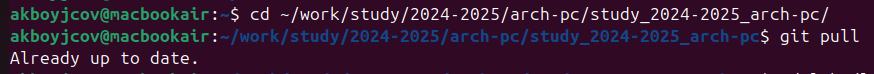
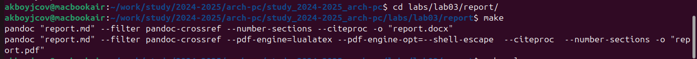
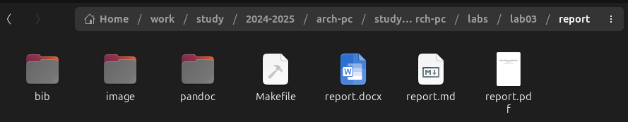
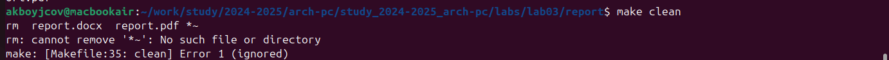
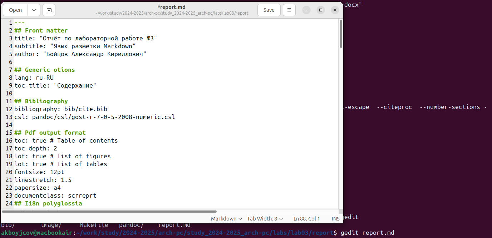

---
## Front matter
title: "Отчёт по лабораторной работе №3"
subtitle: "Язык разметки Markdown"
author: "Бойцов Александр Кириллович Группа: НБИ-бд-01-24 №ст. билета 1132240686	"

## Generic otions
lang: ru-RU
toc-title: "Содержание"

## Bibliography
bibliography: bib/cite.bib
csl: pandoc/csl/gost-r-7-0-5-2008-numeric.csl

## Pdf output format
toc: true # Table of contents
toc-depth: 2
fontsize: 12pt
linestretch: 1.5
papersize: a4
documentclass: scrreprt
## I18n polyglossia
polyglossia-lang:
  name: russian
  options:
	- spelling=modern
	- babelshorthands=true
polyglossia-otherlangs:
  name: english
## I18n babel
babel-lang: russian
babel-otherlangs: english
## Fonts
mainfont: IBM Plex Serif
romanfont: IBM Plex Serif
sansfont: IBM Plex Sans
monofont: IBM Plex Mono
mathfont: STIX Two Math
mainfontoptions: Ligatures=Common,Ligatures=TeX,Scale=0.94
romanfontoptions: Ligatures=Common,Ligatures=TeX,Scale=0.94
sansfontoptions: Ligatures=Common,Ligatures=TeX,Scale=MatchLowercase,Scale=0.94
monofontoptions: Scale=MatchLowercase,Scale=0.94,FakeStretch=0.9
mathfontoptions:
## Biblatex
biblatex: true
biblio-style: "gost-numeric"
biblatexoptions:
  - parentracker=true
  - backend=biber
  - hyperref=auto
  - language=auto
  - autolang=other*
  - citestyle=gost-numeric
## Pandoc-crossref LaTeX customization
figureTitle: "Рис."
listingTitle: "Листинг"
lolTitle: "Листинги"
## Misc options
indent: true
header-includes:
  - \usepackage{indentfirst}
  - \usepackage{float} # keep figures where there are in the text
  - \floatplacement{figure}{H} # keep figures where there are in the text
---

# Цель работы

Целью работы является освоение процедуры оформления отчетов с помощью легковесного языка разметки Markdown.

# Выполнение лабороторной работы

Откроем терминал и перейдем в каталог курса, который был сформирован при выполнении лабораторной работы №2. После перехода обновим локальный репозиторий, скачав изменения из удаленного репозитория с помощью комманды git pull.
{#fig:001 width=100%}

Перейдем в каталог с шаблоном отчета по лабораторной работе №3 и проведем компиляцию шаблона с использованием Makefile. Для этого введем команду make
{#fig:001 width=100%}

После компиляции проверим наличие файлов с расширением .pdf и .docx. Затем, удалим полученные файлы с использованием Makefile. Для этого введем команду make clean
{#fig:001 width=100%}
{#fig:001 width=100%}

Откроем файл report.md с помощью любого текстового редактора, например gedit. Для этого введем команду gedit report.md.
{#fig:001 width=100%}

Далее заполним и скомпилируем отчет с использованием Makefile. Далее, загрузим на Github следующими командами.
git add .
git commit 
git push

# Выводы

В ходе лабораторной работы №3 мы изучили и освоили процедуры оформления отчетов с помощью легковесного языка разметки Markdown.

